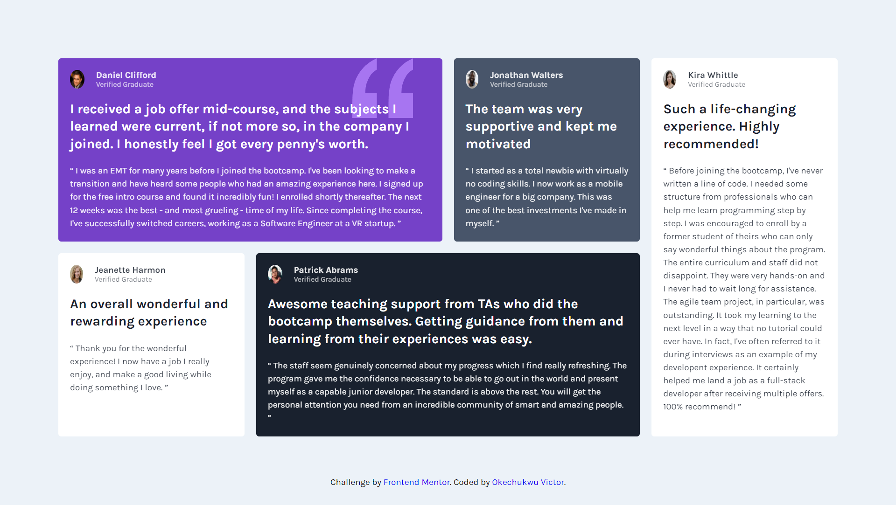
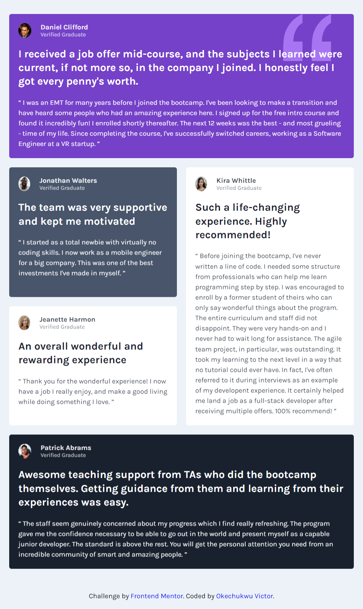

# Frontend Mentor - Testimonials grid section solution

This is a solution to the [Testimonials grid section challenge on Frontend Mentor](https://www.frontendmentor.io/challenges/testimonials-grid-section-Nnw6J7Un7). Frontend Mentor challenges help you improve your coding skills by building realistic projects. 

## Table of contents

- [Overview](#overview)
  - [The challenge](#the-challenge)
  - [Screenshot](#screenshot)
  - [Links](#links)
- [My process](#my-process)
  - [Built with](#built-with)
  - [What I learned](#what-i-learned)
  - [Continued development](#continued-development)
  - [Useful resources](#useful-resources)
- [Author](#author)


## Overview

### The challenge

Users should be able to:

- View the optimal layout for the site depending on their device's screen size

### Screenshot






### Links

- Solution URL: [ solution URL here](https://github.com/covstar/testimonials-grid-section-solution)
- Live Site URL: [live site URL here](https://covstar.github.io/testimonials-grid-section-solution/)

## My process

### Built with

- Semantic HTML5 markup
- CSS custom properties
- Flexbox
- CSS Grid
- Mobile-first workflow


### What I learned

I learnt the power of using CSS Grids for a responsive layout design.

code snippets, see below:

```html
<div>Some HTML code I'm proud of</div>
```
```css
.proud-of-this-css {
  display: grid;
  grid-template-columns: repeat(2,1fr);
  grid-template-areas: "hd hd ";
}

```


### Continued development

CSS Grids with overlaps


## Author

- Website - [Add your name here](https://covstar.github.io/)
- Frontend Mentor - [@covstar](https://www.frontendmentor.io/profile/covstar)
- Twitter - [@okechuk17604541](https://www.twitter.com/okechuk17604541)

